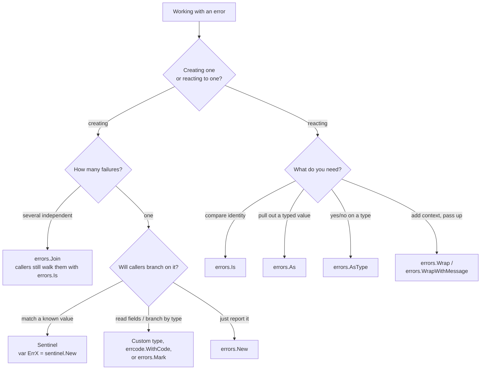

# How to Handle Errors in Go

Go treats errors as ordinary values: a function that can fail returns an
`error` as its last result, and the caller checks it. There is no `try`/`catch`
and no stack unwinding. This looks verbose at first, but it makes the failure
path explicit and easy to follow.

This guide starts from the standard library and builds up to the techniques this
repository provides. Each section answers one question: *given this situation,
which tool do I reach for, and why?*

## The Error Interface

Every error in Go satisfies one small interface:

```go
// Any type with an Error() string method is an error.
type error interface {
	Error() string
}
```

`Error()` returns a human-readable message. By convention the message is
lowercase and has no trailing punctuation, because callers frequently wrap it
inside a larger sentence.

## Checking an Error

The most common pattern is to check for `nil` and stop early:

```go
file, err := os.Open("config.yaml")
if err != nil {
	return fmt.Errorf("open config: %w", err)
}
defer file.Close()
```

Handle the error where you check it, or return it to someone who can. The one
thing never to do is ignore it — a discarded error is a bug that has not
happened yet.

## A Drop-in `errors` Package

This repository's root package,
`github.com/StevenACoffman/toerr/errors`, is a drop-in replacement for the
standard library. It re-exports `Is`, `As`, `Unwrap`, and `Join` unchanged, and
adds four things the standard library leaves out:

- `New` and `Wrap` **record where they were called** (file, line, function).
- Both accept trailing `slog.Attr` values, so an error carries **structured
  context** for logging, not just a string.
- `Mark` / `AsType` let you **tag an error for control flow** by type.
- Errors render a **return trace** under `%+v` and implement `slog.LogValuer`.

```go
import errors "github.com/StevenACoffman/toerr/errors"
```

The rest of this guide uses that package.

## Sentinel Errors: Comparing Identity with `errors.Is`

A sentinel is a predefined error value that callers can recognize. Define it
once at package level with the `Err` prefix. Use the `sentinel` package, whose
values are cheap — they do **not** capture a stack (a stack taken at package-init
time would be meaningless):

```go
var ErrNotFound = sentinel.New("resource not found")

func findUser(id string) (string, error) {
	if id == "" {
		return "", ErrNotFound
	}
	return "Alice", nil
}
```

Compare against a sentinel with `errors.Is`, **not** `==`. `errors.Is` walks the
whole chain of wrapped errors, so it keeps working even after the sentinel has
been wrapped with extra context:

```go
if _, err := findUser(""); errors.Is(err, ErrNotFound) {
	fmt.Println("user was not found")
}

// Standard-library sentinels work the same way.
if errors.Is(err, io.EOF) {
	fmt.Println("reached end of input")
}
```

A sentinel matches by **identity**, so it must be a package-level variable:
two independent `sentinel.New("not found")` values are deliberately *not* equal.
Reach for a sentinel when callers only need to answer a yes/no question: *is this
that specific, well-known condition?*

## Custom Types and Marks: Reacting by Type with `errors.As` / `AsType`

When callers need structured information — a status code, a field name, a
retry-after duration — define a type instead of a bare value:

```go
type APIError struct {
	StatusCode int
	Endpoint   string
	Message    string
}

func (e *APIError) Error() string {
	return fmt.Sprintf("api %d at %s: %s", e.StatusCode, e.Endpoint, e.Message)
}
```

Pull the concrete type back out with `errors.As`, which — like `errors.Is` —
searches through wrapping:

```go
var apiErr *APIError
if errors.As(err, &apiErr) {
	fmt.Println("status:", apiErr.StatusCode)
}
```

Go 1.26's generic `errors.AsType` (re-exported here) skips the pre-declared
variable and returns the found value plus a boolean:

```go
if apiErr, ok := errors.AsType[*APIError](err); ok {
	fmt.Println("status:", apiErr.StatusCode)
}
```

`AsType` also works with **marks**. `Mark` tags an existing error with a marker
whose type `AsType` will then recognize — without changing the error's message or
its `Unwrap` chain. If the error was not produced by this package, `Mark` wraps
it first so it still carries a trace:

```go
var ErrRateLimited = &RateLimitError{}

err = errors.Mark(err, ErrRateLimited)                // transparent tag
if _, ok := errors.AsType[*RateLimitError](err); ok { // matches anywhere up the chain
	backoffAndRetry()
}
```

Prefer a custom type or a mark when callers must *branch on a category*; prefer a
sentinel when they match a single well-known value.

## Wrapping for Context — and What `%w` Leaves Out

As an error travels up the call stack, each layer can add context with the `%w`
verb:

```go
data, err := os.ReadFile(path)
if err != nil {
	return nil, fmt.Errorf("load config %q: %w", path, err)
}
```

`%w` records the wrapped error as a *value*, which is why `errors.Is` and
`errors.As` keep working through the chain. The resulting message reads as a
trail of context:

```text
init app: load config "/etc/app.yaml": open /etc/app.yaml: no such file or directory
```

**But `fmt.Errorf` captures no file, line, or function.** It only concatenates
strings. When that message shows up in a log, you get the *what* but not the
*where* — you are left grepping the source for the literal text `load config`.

This repository closes that gap. `Wrap` records the call site as the error passes
through; `WrapWithMessage` does the same *and* prepends a message:

```go
// Wrap: add location (and optional attrs), no message change.
if err != nil {
	return errors.Wrap(err)
}

// WrapWithMessage: add "message: cause" plus location.
if err != nil {
	return errors.WrapWithMessage(err, fmt.Sprintf("load config %q", path))
}
```

Render the accumulated trace when you log, with `%+v`:

```go
slog.Error("request failed", "err", fmt.Sprintf("%+v", err))
```

```text
load config "/etc/app.yaml": open /etc/app.yaml: no such file or directory

main.loadConfig
	/app/config.go:14
main.initApp
	/app/init.go:9
```

### Return Trace, Not Stack Trace

Each `New` and `Wrap` records a single frame — its own call site. Collected along
the chain and printed origin-first, they form a **return trace**: the path the
error took as it was returned out to the caller.

This is a different thing from a stack trace. A stack trace is captured once, at
creation, and answers *how did we get to where the error started?* A return trace
is built incrementally, one frame per wrap, and answers *how did this escalate on
its way out?* Because it is assembled as the error propagates rather than
snapshotted at one instant, it works even when the error is sent over a channel or
stored and returned from a different goroutine — where a creation-time stack would
be misleading. There is no full stack and no runtime tail: `%+v` shows only the
frames you wrapped through. This follows the `braces.dev/errtrace` model.

The trace machinery keys off errtrace's exported marker interface — any error
with a `TracePC() uintptr` method contributes a frame — and this package's errors
implement it. So the two packages interoperate: an `errtrace.Wrap`-ed error
nested in one of these chains appears in `%+v`, and these errors appear in
`errtrace.Format`. You can mix them without losing frames from either.

## Combining Independent Failures with `errors.Join`

`%w` models a **chain**: this failed *because* that failed. Sometimes you instead
have several **independent** failures that all matter at once — validation of
many fields, errors from a batch of goroutines, or a cleanup that fails while
handling an earlier error. `errors.Join` collects them:

```go
func validate(name, email string) error {
	var errs []error
	if name == "" {
		errs = append(errs, errors.New("name is required"))
	}
	if email == "" {
		errs = append(errs, errors.New("email is required"))
	}
	return errors.Join(errs...) // nil if errs is empty
}
```

`Join` returns an error whose `Error()` is the children joined by newlines, and
whose `Unwrap() []error` method exposes the slice. This is a different interface
from single wrapping (`Unwrap() error`), and it shapes how joined errors behave:

- `errors.Is` and `errors.As` (and therefore `AsType`) traverse **every** branch,
  so a sentinel or type buried in one of the joined errors is still found.
- To inspect the branches yourself, type-assert the multi-error interface:
  `if m, ok := err.(interface{ Unwrap() []error }); ok { … m.Unwrap() … }`.
- Consumers can fold across the branches. `errclass.GetClass` does exactly this:
  it walks the joined errors and returns the most severe class (`Transient` vs
  `Persistent`), so a batch containing one persistent failure is persistent
  overall.
- `%+v` renders a joined error as a tree, drawing each branch under a `+-`
  connector with `|` gutters and the wrapping error's own trace at the bottom.

Use `%w` for a causal chain and `errors.Join` for a set of siblings. They
compose: a joined error may contain wrapped errors, and a wrapped error may wrap
a joined one.

## Domain Codes and Boundary Translation

Callers should not have to know that your storage layer happens to use
`database/sql`, or that a lookup used the filesystem. Errors like `sql.ErrNoRows`
and `os.ErrNotExist` are implementation details — **translate them into a domain
code at the boundary** before they escape, rather than letting callers match on
them directly.

This repository uses `errcode` for that. A small, transport-neutral set of status
codes lives in one place:

```go
func (s *Store) FindUser(ctx context.Context, id int) (*User, error) {
	u, err := s.query(ctx, id)
	if errors.Is(err, sql.ErrNoRows) {
		return nil, errcode.WithCode(errcode.StatusNotFound, "user not found", err)
	}
	if err != nil {
		return nil, errcode.WithCode(errcode.StatusInternal, "", err)
	}
	return u, nil
}
```

At the edge of the program, read the code back and map it to the transport —
without knowing anything about the concrete error type:

```go
func writeError(w http.ResponseWriter, err error) {
	status, message := errhttp.Error(err) // maps the domain code to HTTP here
	http.Error(w, message, status)
}
```

The domain code lives in `errcode`; the HTTP mapping lives in the `errhttp`
adapter. `errcode` imports no transport package, so the same coded error serves
HTTP, gRPC, or a CLI unchanged — each transport gets its own thin adapter.

Keeping the transport mapping at the boundary means the same error works
unchanged whether it surfaces over HTTP, gRPC, or a CLI.

## Attaching Context for Logs

When the useful context is structured data rather than prose — a user ID, a
request ID, a retry count — attach it as `slog` attributes instead of formatting
it into the message. `New`, `Wrap`, and `WrapWithMessage` all take trailing
attributes:

```go
err := errors.New("checkout failed",
	slog.Int("user_id", id), slog.String("op", "checkout"))
err = errors.Wrap(err, slog.Int("retry", n))
```

At the log site, collect every attribute along the chain with `Attrs` and hand
them to `LogAttrs`:

```go
logger.LogAttrs(ctx, slog.LevelError, err.Error(), errors.Attrs(err)...)
```

Errors also implement `slog.LogValuer`, so passing one directly promotes its
message and attributes:

```go
logger.Error("request failed", slog.Any("err", err))
```

The message stays clean and greppable; the structured fields stay queryable in
your log backend.

Note the deliberate split: **context** — open-ended, caller-supplied key/values —
lives in `[]slog.Attr`, while an error's **structure** (its message, cause, and
call site) lives in typed fields. See the README's "structure vs. context"
section for why.

## Knowing When to Give Up

Not every error is worth handling:

- **Some failures are unrecoverable** — a violated invariant, internal
  inconsistency, out of memory. Prefer to `panic` at the point of detection
  rather than threading a check through code that cannot do anything useful with
  it.
- **Some errors can be designed away.** Redefining an operation as "ensure X is
  absent" (which always succeeds) removes a failure mode that "delete X, error if
  missing" would introduce. The best error handling is the error that can no
  longer occur.
- **Handle an error once, where it is meaningful.** Let it propagate to a single
  high-level handler that logs it (with its trace) and turns it into a response,
  instead of logging-and-continuing at every layer.

## Choosing a Pattern



## Best Practices Summary

01. Check every returned error. Never discard one with `_` in real code.
02. Compare with `errors.Is` and extract with `errors.As` / `AsType` — never `==`
    or a bare type assertion, which miss wrapped errors.
03. Wrap for context as errors rise, but capture **location**, not just a string
    prefix — use `errors.Wrap` / `errors.WrapWithMessage`.
04. Translate external errors (`sql.ErrNoRows`, `os.ErrNotExist`) into domain codes
    at the implementation boundary; do not let them leak to callers.
05. Use a sentinel for identity, a custom type / mark / `errcode` for structured
    data, and `errors.Join` for independent failures collected together.
06. Keep structured context in `slog.Attr` values on the error; keep the message
    clean. Log once with `errors.Attrs` + `LogAttrs`.
07. Map domain codes to a transport (HTTP status) only at the edge, never inside
    the error type.
08. `panic` on unrecoverable invariant violations instead of threading checks that
    cannot improve the outcome; where you can, design the error out of existence.
09. Return errors rather than logging and continuing — let one high-level handler
    log the error with its trace and decide the response.
10. Keep messages lowercase and free of trailing punctuation.

## The Packages in This Repository

- `errors` (root) — the primary API: `New`, `Wrap`, `WrapWithMessage`, `Mark`,
  `AsType`, `Attrs`, and the re-exported `Is`/`As`/`Unwrap`/`Join`. Records call
  sites, carries `slog` attributes, and renders a return trace under `%+v`.
- `sentinel` — cheap, stack-free sentinel values for `errors.Is` matching.
- `errcode` — transport-neutral status codes (`WithCode`, `Code`, `Status`,
  `Payload`). No transport concern lives here.
- `errhttp` — the HTTP adapter for `errcode`: `Status`, `StatusMessage`, and
  `Error(err)` map a domain code to an HTTP status at the boundary.
- `errclass` — coarse severity classification (`Transient`, `Persistent`) that
  folds correctly across joined errors.
